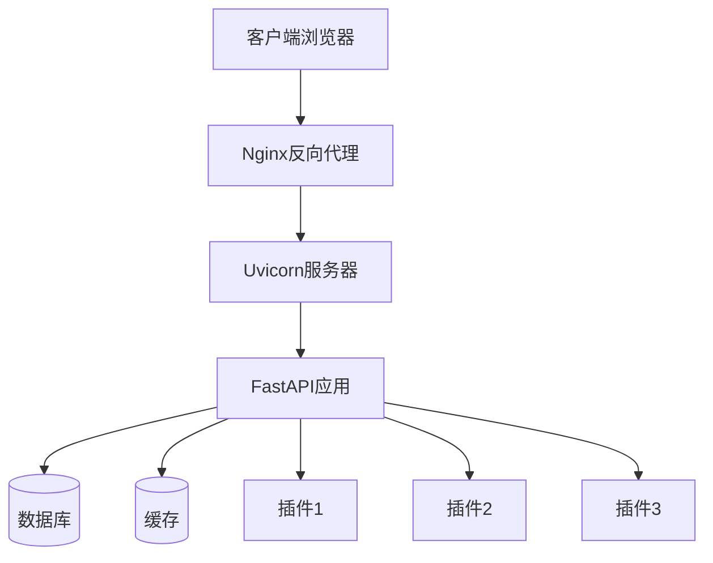

# FastAPI Admin Panel 架构图

```mermaid
flowchart TD
    %% 应用入口
    A[run.py] --> B[base/start.py]
    
    %% 应用初始化
    B --> |创建应用| C[FastAPI实例]
    B --> |注册中间件| D[中间件系统]
    B --> |注册路由| E[路由系统]
    B --> |注册异常处理| F[异常处理系统]
    B --> |初始化插件| G[插件管理器]
    B --> |数据库初始化| H[Tortoise ORM]
    
    %% 公共组件
    I[base/common/] --> D
    I --> E
    I --> F
    I --> G
    I --> H
    
    %% 公共组件详细
    I --> I1[配置管理 config.py]
    I --> I2[数据库连接 database.py]
    I --> I3[权限管理 permissions.py]
    I --> I4[响应格式化 response.py]
    I --> I5[安全认证 security.py]
    I --> I6[日志系统 log.py]
    
    %% 核心业务模块
    J[base/core/] --> E
    J --> |模块中间件| D
    
    %% 业务模块结构
    J --> J1[users/]
    J --> J2[dept/]
    J --> J3[extension/]
    
    %% 模块内部结构
    J1 --> J11[api/v1/] --> |路由| E
    J1 --> J12[models/] --> |数据库模型| H
    J1 --> J13[schemas/] --> |数据验证| J11
    J1 --> J14[services/] --> |业务逻辑| J11
    J1 --> J15[middleware/] --> |模块中间件| D
    
    J2 --> J21[api/v1/] --> |路由| E
    J2 --> J22[models/] --> |数据库模型| H
    J2 --> J23[schemas/] --> |数据验证| J21
    J2 --> J24[services/] --> |业务逻辑| J21
    
    J3 --> J31[api/v1/] --> |路由| E
    J3 --> J32[models/] --> |数据库模型| H
    J3 --> J33[schemas/] --> |数据验证| J31
    J3 --> J34[services/] --> |业务逻辑| J31
    
    %% 插件系统
    G --> K[base/plugins/]
    K --> K1[插件1/]
    K --> K2[插件2/]
    
    %% 插件结构
    K1 --> K11[api/]
    K1 --> K12[models/]
    K1 --> K13[schemas/]
    K1 --> K14[services/]
    K1 --> K15[manifest.json]
    
    K11 --> |动态路由| E
    K12 --> |动态模型| H
    K15 --> |插件配置| G
    
    %% 前端
    L[web/src/] --> |API调用| C
    L --> L1[api/] --> |API客户端| C
    L --> L2[views/] --> |页面| L1
    L --> L3[components/] --> |组件| L2
    L --> L4[router/] --> |路由| L2
    L --> L5[stores/] --> |状态管理| L2
    
    %% 数据流向
    C --> |请求处理| D
    D --> |验证用户| I5
    D --> |检查权限| I3
    D --> |转发请求| E
    E --> |调用业务逻辑| J14
    J14 --> |操作数据| H
    H --> |返回数据| J14
    J14 --> |格式化响应| I4
    I4 --> |返回给客户端| C
    
    %% 异常处理
    J14 --> |抛出异常| F
    E --> |抛出异常| F
    D --> |抛出异常| F
    F --> |格式化错误响应| C
```

## 架构说明

### 1. 应用入口层
- **run.py**: 应用启动脚本，配置Uvicorn服务器并启动应用
- **base/start.py**: 应用初始化核心，创建FastAPI实例，配置生命周期钩子，注册中间件、路由和异常处理

### 2. 公共组件层
- **配置管理**: 集中管理应用配置
- **数据库连接**: 初始化Tortoise ORM连接
- **权限管理**: 定义和检查用户权限
- **响应格式化**: 统一API响应格式
- **安全认证**: 处理用户认证和授权
- **日志系统**: 应用日志记录

### 3. 核心业务层
采用模块化设计，每个业务模块（users, dept, extension）都有统一的结构：
- **API层**: 定义RESTful接口，处理HTTP请求
- **模型层**: 定义数据库表结构
- **模式层**: 定义请求和响应的数据结构
- **服务层**: 实现业务逻辑
- **中间件层**: 模块特定的请求处理逻辑

### 4. 插件系统
- **动态加载**: 支持运行时加载和卸载插件
- **统一接口**: 所有插件遵循相同的结构和约定
- **依赖管理**: 支持插件间依赖关系
- **路由集成**: 插件路由自动注册到主应用

### 5. 前端层
- **API客户端**: 封装API调用
- **页面组件**: 实现用户界面
- **路由管理**: 前端页面导航
- **状态管理**: 全局状态管理

### 6. 请求处理流程
1. 客户端发送请求到FastAPI应用
2. 中间件系统处理请求（CORS、认证、日志等）
3. 路由系统匹配对应的API处理函数
4. 业务服务层处理业务逻辑
5. 数据层操作数据库
6. 响应格式化后返回给客户端
7. 异常处理系统捕获并处理错误

## 核心特性

### 1. 自动发现机制
- **路由自动发现**: 自动扫描并注册所有业务模块和插件的路由
- **中间件自动发现**: 自动扫描并注册所有业务模块和插件的中间件

### 2. 插件化架构
- **热插拔**: 支持在不重启应用的情况下安装、启用、禁用和卸载插件
- **松耦合**: 插件与核心系统之间通过接口交互，降低耦合度
- **可扩展性**: 轻松添加新功能而不修改核心代码

### 3. 安全设计
- **认证机制**: 基于JWT的用户认证
- **权限控制**: 细粒度的权限管理
- **数据验证**: 使用Pydantic进行请求数据验证

### 4. 开发体验
- **自动文档**: 生成交互式API文档（Swagger UI和ReDoc）
- **类型提示**: 充分利用Python类型提示，提高代码可读性和IDE支持
- **统一响应**: 标准化API响应格式
- **异常处理**: 统一的异常处理机制

## 技术栈

### 后端
- **FastAPI**: 高性能Web框架
- **Tortoise ORM**: 异步ORM框架
- **Python 3.7+**: 支持异步编程

### 前端
- **Vue 3**: 前端框架
- **Pinia**: 状态管理
- **Vue Router**: 路由管理
- **Axios**: HTTP客户端

### 数据库
- **关系型数据库**: 支持MySQL、PostgreSQL等
- **Tortoise ORM**: 异步数据库操作

## 部署架构

## 总结

这个FastAPI管理面板采用了现代、模块化的架构设计，具有以下优势：

1. **高内聚低耦合**: 各组件职责明确，模块间通过接口交互
2. **可扩展性**: 插件系统支持动态扩展功能
3. **高性能**: 基于FastAPI和异步编程，处理高并发请求
4. **易维护**: 统一的代码结构和开发规范
5. **安全可靠**: 完善的认证、授权和数据验证机制
6. **良好的开发体验**: 自动文档、类型提示和统一响应格式

这种架构设计使得应用易于维护和扩展，适合构建复杂的企业级管理系统。