# 概述

本文档描述 MES（制造执行系统）的整体架构设计，包含五大分层架构、九大业务领域和 54 个功能模块。

# 架构总览

## 模块统计

| 类别 | 数量 | 颜色标识 |
|------|------|----------|
| 已有模块 | 13 个 | 🟢 绿色 |
| 补充模块 | 41 个 | 🔴 红色 |
| 分组容器 | 8 个 | 灰色虚线框 |

## 层级架构图

```mermaid
graph LR
    subgraph Layer1["系统集成层"]
        direction TB
        A1[ERP 集成]
        A2[WMS 集成]
        A3[设备/PLC 集成]
        A4[条码/RFID 集成]
        A5[PLM 集成]
        A6[工作流引擎]
        A7[消息通知中心]
    end

    subgraph Layer2["决策分析层"]
        direction TB
        B1[生产报表]
        B2[质量报表]
        B3[设备报表]
        B4[库存报表]
        B5[成本分析]
        B6[电子看板]
        B7[追溯管理]
    end

    subgraph Layer3["生产计划管理"]
        direction TB
        C1[主生产计划MPS]
        C2[物料需求计划MRP]
        C3[生产排程/调度]
        C4[班次/日历管理]
        C5[制造单]
        C6[工单]
    end

    subgraph Layer4["生产执行管理"]
        direction TB
        D1[生产报工]
        D2[在制品WIP跟踪]
        D3[异常管理]
        D4[领料/退料]
        D5[人员/班组]
        D6[调拨]
    end

    subgraph Layer5["质量管理"]
        direction TB
        E1[检验标准/方案]
        E2[来料检验IQC]
        E3[过程检验IPQC]
        E4[成品检验FQC]
        E5[不合格品处理]
        E6[质检]
    end

    subgraph Layer6["设备管理"]
        direction TB
        F1[设备状态监控]
        F2[设备维护保养]
        F3[故障管理]
        F4[OEE 计算]
        F5[模具/工装管理]
        F6[设备]
    end

    subgraph Layer7["库存管理"]
        direction TB
        G1[入库管理]
        G2[出库管理]
        G3[库存盘点]
        G4[批次/序列号管理]
        G5[库存预警]
        G6[库存]
    end

    subgraph Layer8["基础数据管理"]
        direction TB
        H1[物料主数据]
        H2[BOM]
        H3[生产路线]
        H4[工作中心]
        H5[工艺/工序]
        H6[供应商/客户]
        H7[包裹]
        H8[库位]
    end

    Layer1 -->|数据集成| Layer2
    Layer2 -->|分析决策| Layer3
    Layer2 -->|分析决策| Layer4
    Layer2 -->|分析决策| Layer5
    Layer2 -->|分析决策| Layer6
    Layer2 -->|分析决策| Layer7
    Layer3 -->|计划驱动| Layer4
    Layer4 -->|执行反馈| Layer5
    Layer4 -->|执行反馈| Layer6
    Layer4 -->|执行反馈| Layer7
    Layer8 -.->|支撑| Layer3
    Layer8 -.->|支撑| Layer4
    Layer8 -.->|支撑| Layer5
    Layer8 -.->|支撑| Layer6
    Layer8 -.->|支撑| Layer7
```

# 各层详细说明

## 系统集成层

系统集成层是 MES 与外部系统的接口层，负责数据交换和通信。

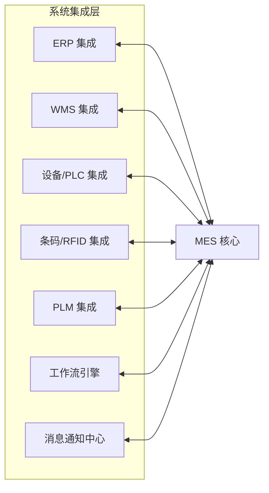

| 模块 | 说明 | 状态 |
|------|------|------|
| ERP 集成 | 与 ERP 系统对接，同步订单、物料、成本数据 | 🔴 补充 |
| WMS 集成 | 与仓储管理系统对接，同步库存数据 | 🔴 补充 |
| 设备/PLC 集成 | 与生产设备通信，采集实时数据 | 🔴 补充 |
| 条码/RFID 集成 | 条码扫描和 RFID 读取，实现数据采集 | 🔴 补充 |
| PLM 集成 | 与产品生命周期管理系统对接，同步工艺数据 | 🔴 补充 |
| 工作流引擎 | 审批流程、业务流程管理 | 🔴 补充 |
| 消息通知中心 | 系统通知、预警通知、任务提醒 | 🔴 补充 |

## 决策分析层

决策分析层提供报表、分析和可视化功能，支持管理层决策。

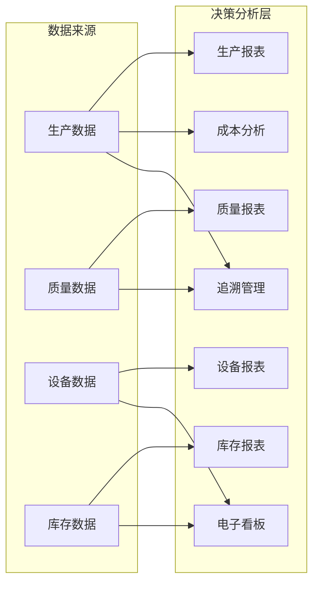

| 模块 | 说明 | 状态 |
|------|------|------|
| 生产报表 | 生产进度、产量、效率等报表 | 🔴 补充 |
| 质量报表 | 质量统计、合格率、不良分析报表 | 🔴 补充 |
| 设备报表 | 设备利用率、故障统计报表 | 🔴 补充 |
| 库存报表 | 库存周转、呆滞库存分析 | 🔴 补充 |
| 成本分析 | 生产成本分析、成本核算 | 🔴 补充 |
| 电子看板 | 生产现场可视化展示 | 🔴 补充 |
| 追溯管理 | 产品全生命周期追溯 | 🔴 补充 |

## 生产计划管理

生产计划管理负责生产计划的制定和工单管理。

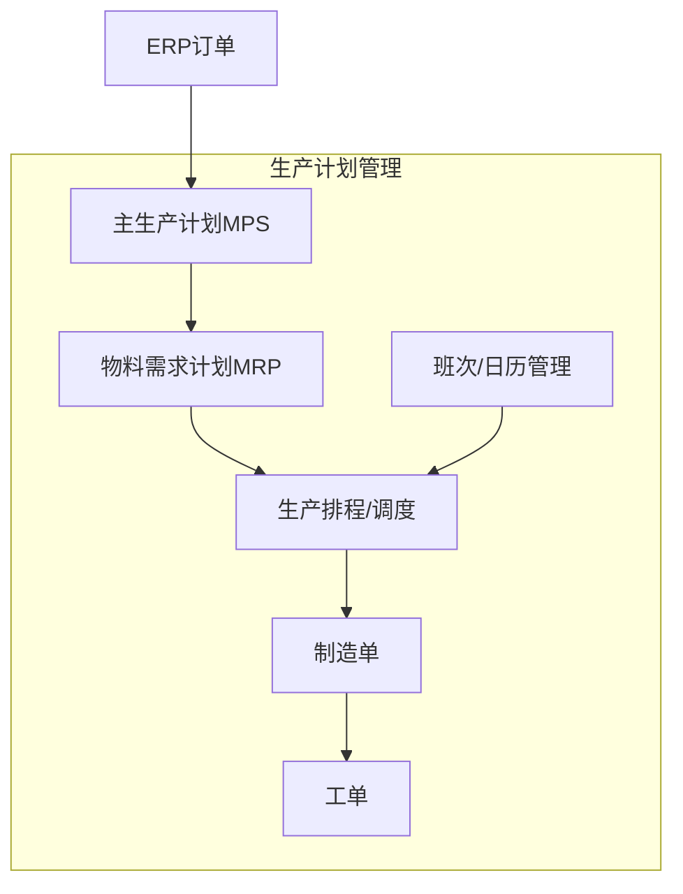

| 模块 | 说明 | 状态 |
|------|------|------|
| 主生产计划 MPS | 根据订单制定主生产计划 | 🔴 补充 |
| 物料需求计划 MRP | 计算物料需求，生成采购建议 | 🔴 补充 |
| 生产排程/调度 | 详细排程，分配资源和时间 | 🔴 补充 |
| 班次/日历管理 | 工厂日历、班次定义 | 🔴 补充 |
| 制造单 | 生产订单管理 | 🟢 已有 |
| 工单 | 具体作业任务单据 | 🟢 已有 |

## 生产执行管理

生产执行管理负责生产过程的控制和执行。

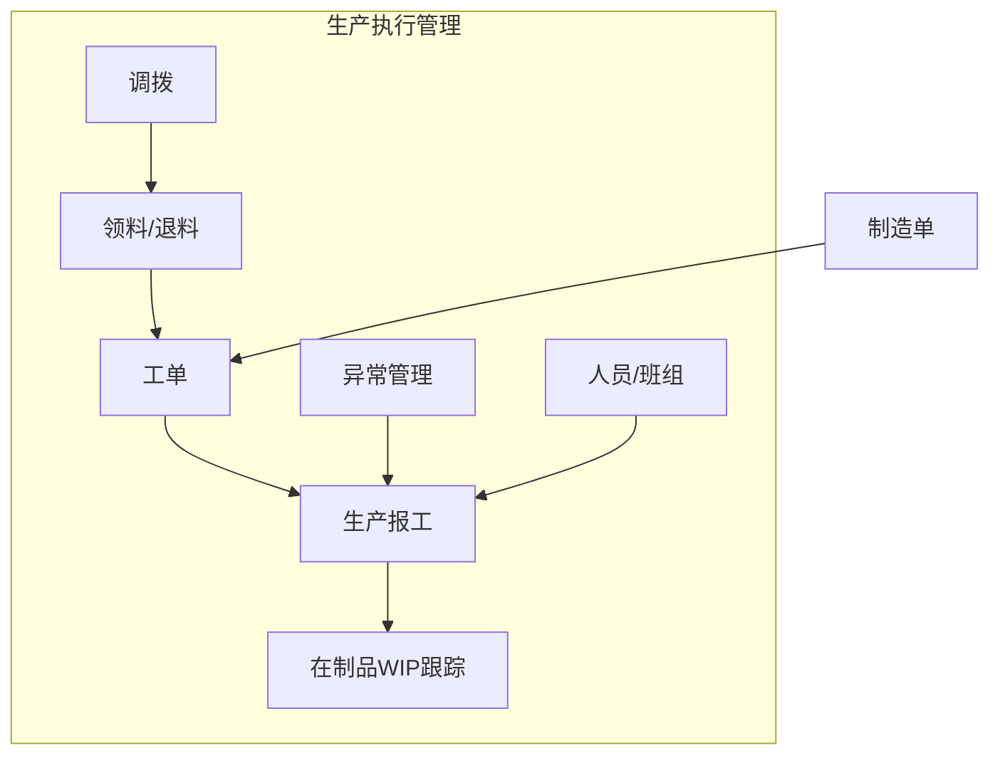

| 模块 | 说明 | 状态 |
|------|------|------|
| 生产报工 | 工单完工报告、进度反馈 | 🔴 补充 |
| 在制品 WIP 跟踪 | 实时跟踪在制品状态和数量 | 🔴 补充 |
| 异常管理 | 生产异常记录和处理 | 🔴 补充 |
| 领料/退料 | 物料领取和退回管理 | 🔴 补充 |
| 人员/班组 | 人员排班、班组管理 | 🔴 补充 |
| 调拨 | 物料调拨管理 | 🟢 已有 |

## 质量管理

质量管理负责产品质量的检验和控制。

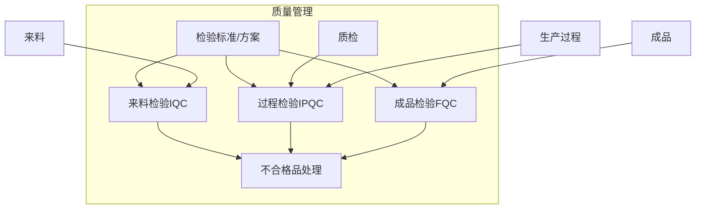

| 模块 | 说明 | 状态 |
|------|------|------|
| 检验标准/方案 | 定义检验标准和抽样方案 | 🔴 补充 |
| 来料检验 IQC | 来料质量检验 | 🔴 补充 |
| 过程检验 IPQC | 生产过程质量检验 | 🔴 补充 |
| 成品检验 FQC/OQC | 成品出厂检验 | 🔴 补充 |
| 不合格品处理 | 不合格品的评审和处理 | 🔴 补充 |
| 质检 | 质检记录管理 | 🟢 已有 |

## 设备管理

设备管理负责生产设备的状态监控和维护。

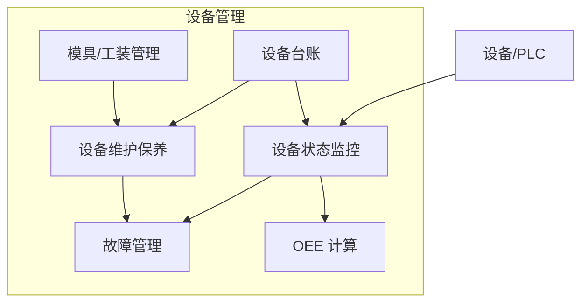

| 模块 | 说明 | 状态 |
|------|------|------|
| 设备状态监控 | 实时监控设备运行状态 | 🔴 补充 |
| 设备维护保养 | 设备保养计划、保养记录 | 🔴 补充 |
| 故障管理 | 设备故障记录和维修管理 | 🔴 补充 |
| OEE 计算 | 设备综合效率计算分析 | 🔴 补充 |
| 模具/工装管理 | 模具和工装管理 | 🔴 补充 |
| 设备 | 设备台账管理 | 🟢 已有 |

## 库存管理

库存管理负责车间物料的存储和管理。

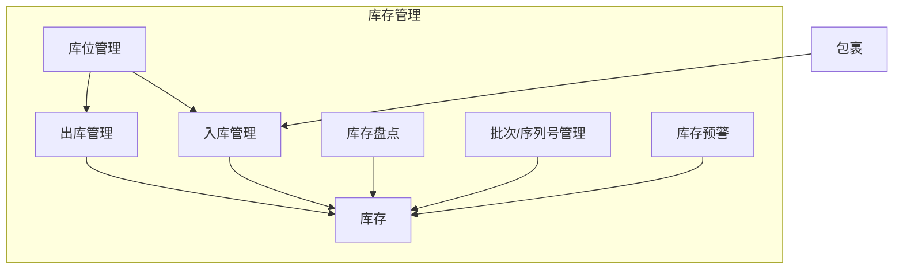

| 模块 | 说明 | 状态 |
|------|------|------|
| 入库管理 | 物料入库登记 | 🔴 补充 |
| 出库管理 | 物料出库登记 | 🔴 补充 |
| 库存盘点 | 库存盘点作业 | 🔴 补充 |
| 批次/序列号管理 | 批次和序列号追溯 | 🔴 补充 |
| 库存预警 | 库存不足预警 | 🔴 补充 |
| 库存 | 库存查询管理 | 🟢 已有 |

## 基础数据管理

基础数据管理是 MES 的数据基础，提供核心数据支持。

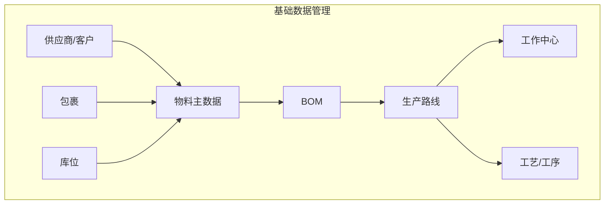

| 模块 | 说明 | 状态 |
|------|------|------|
| 物料主数据 | 物料基本信息管理 | 🔴 补充 |
| BOM | 物料清单管理 | 🟢 已有 |
| 生产路线 | 生产工艺路线定义 | 🟢 已有 |
| 工作中心 | 生产资源和工作站定义 | 🟢 已有 |
| 工艺/工序 | 工艺流程和工序定义 | 🟢 已有 |
| 供应商/客户 | 供应商和客户信息 | 🔴 补充 |
| 包裹 | 包裹定义管理 | 🟢 已有 |
| 库位 | 库位定义管理 | 🟢 已有 |

# 数据流向

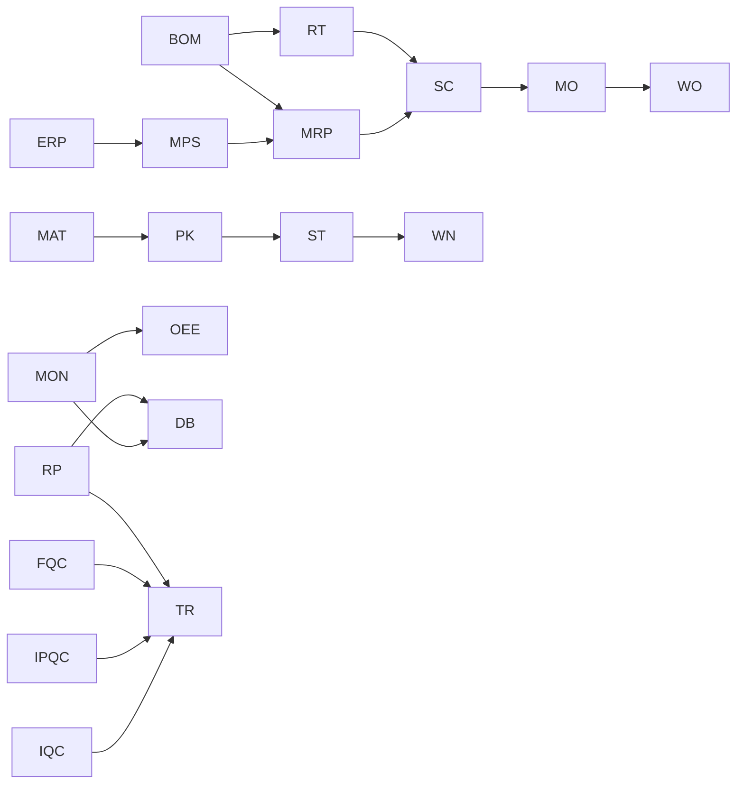

# 实施建议

## 优先级排序

### 第一阶段：基础建设

1. 基础数据管理完善（物料主数据、供应商/客户）
2. 系统集成接口建设（ERP 集成、设备/PLC 集成）
3. 生产执行核心功能（生产报工、领料/退料）

### 第二阶段：业务完善

1. 生产计划功能（MPS、MRP、排程）
2. 质量管理完善（IQC、IPQC、FQC）
3. 库存管理完善（入库、出库、盘点）
4. 设备管理（监控、维护、OEE）

### 第三阶段：决策支持

1. 报表系统建设
2. 电子看板实施
3. 追溯管理完善
4. 成本分析

## 技术架构建议

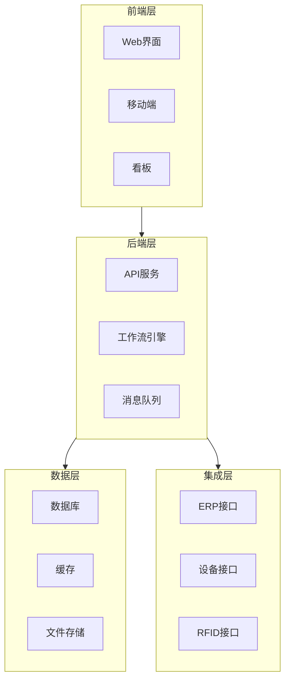

# 附录

## 模块清单汇总

| 序号 | 分组 | 模块名称 | 状态 |
|------|------|----------|------|
| 1 | 系统集成层 | ERP 集成 | 补充 |
| 2 | 系统集成层 | WMS 集成 | 补充 |
| 3 | 系统集成层 | 设备/PLC 集成 | 补充 |
| 4 | 系统集成层 | 条码/RFID 集成 | 补充 |
| 5 | 系统集成层 | PLM 集成 | 补充 |
| 6 | 系统集成层 | 工作流引擎 | 补充 |
| 7 | 系统集成层 | 消息通知中心 | 补充 |
| 8 | 决策分析层 | 生产报表 | 补充 |
| 9 | 决策分析层 | 质量报表 | 补充 |
| 10 | 决策分析层 | 设备报表 | 补充 |
| 11 | 决策分析层 | 库存报表 | 补充 |
| 12 | 决策分析层 | 成本分析 | 补充 |
| 13 | 决策分析层 | 电子看板 | 补充 |
| 14 | 决策分析层 | 追溯管理 | 补充 |
| 15 | 生产计划管理 | 主生产计划 MPS | 补充 |
| 16 | 生产计划管理 | 物料需求计划 MRP | 补充 |
| 17 | 生产计划管理 | 生产排程/调度 | 补充 |
| 18 | 生产计划管理 | 班次/日历管理 | 补充 |
| 19 | 生产计划管理 | 制造单 | 已有 |
| 20 | 生产计划管理 | 工单 | 已有 |
| 21 | 生产执行管理 | 生产报工 | 补充 |
| 22 | 生产执行管理 | 在制品 WIP 跟踪 | 补充 |
| 23 | 生产执行管理 | 异常管理 | 补充 |
| 24 | 生产执行管理 | 领料/退料 | 补充 |
| 25 | 生产执行管理 | 人员/班组 | 补充 |
| 26 | 生产执行管理 | 调拨 | 已有 |
| 27 | 质量管理 | 检验标准/方案 | 补充 |
| 28 | 质量管理 | 来料检验 IQC | 补充 |
| 29 | 质量管理 | 过程检验 IPQC | 补充 |
| 30 | 质量管理 | 成品检验 FQC | 补充 |
| 31 | 质量管理 | 不合格品处理 | 补充 |
| 32 | 质量管理 | 质检 | 已有 |
| 33 | 设备管理 | 设备状态监控 | 补充 |
| 34 | 设备管理 | 设备维护保养 | 补充 |
| 35 | 设备管理 | 故障管理 | 补充 |
| 36 | 设备管理 | OEE 计算 | 补充 |
| 37 | 设备管理 | 模具/工装管理 | 补充 |
| 38 | 设备管理 | 设备 | 已有 |
| 39 | 库存管理 | 入库管理 | 补充 |
| 40 | 库存管理 | 出库管理 | 补充 |
| 41 | 库存管理 | 库存盘点 | 补充 |
| 42 | 库存管理 | 批次/序列号管理 | 补充 |
| 43 | 库存管理 | 库存预警 | 补充 |
| 44 | 库存管理 | 库存 | 已有 |
| 45 | 基础数据管理 | 物料主数据 | 补充 |
| 46 | 基础数据管理 | BOM | 已有 |
| 47 | 基础数据管理 | 生产路线 | 已有 |
| 48 | 基础数据管理 | 工作中心 | 已有 |
| 49 | 基础数据管理 | 工艺/工序 | 已有 |
| 50 | 基础数据管理 | 供应商/客户 | 补充 |
| 51 | 基础数据管理 | 包裹 | 已有 |
| 52 | 基础数据管理 | 库位 | 已有 |